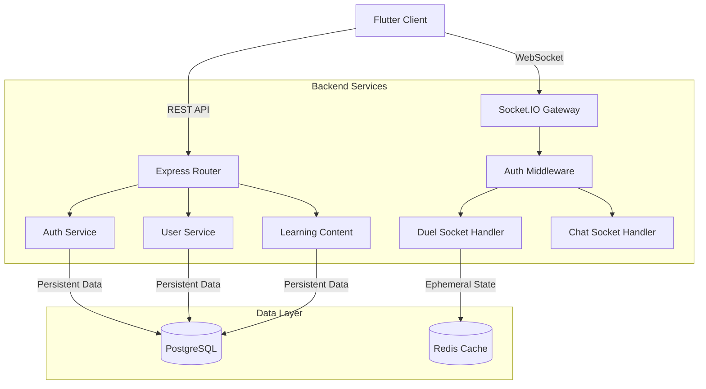

# LearnDules - Competitive Learning Platform

**LearnDules** is a cross-platform (Mobile & Web) competitive learning application designed to gamify the process of mastering Computer Science (CS) topics. It combines structured learning paths with real-time PvP battles, social features, and a comprehensive leveling system.

---

## 🏗️ System Architecture

The system is built on a scalable microservices-like architecture (modular monolith) designed to handle real-time interactions and high-concurrency requests.

### **Tech Stack**

| Component | Technology | Description |
| :--- | :--- | :--- |
| **Frontend** | Flutter | Cross-platform (iOS, Android, Web) UI with Riverpod for state management. |
| **Backend** | Node.js (Express) | REST API and WebSocket server. |
| **Real-time** | Socket.IO | Bi-directional communication for duels, challenges, and chat. |
| **Database** | PostgreSQL | Relational data persistence (managed via Prisma ORM). |
| **Caching/State** | Redis | Session store, Socket.IO adapter for clustering, and temporary duel state. |
| **Storage** | Cloudinary | Media asset storage (avatars, question images). |

### **Connection Flow**



---

## 🔌 Real-Time Socket Architecture

The core of the competitive mode lies in its WebSocket implementation (`backend/src/sockets`).

### **Socket Initialization (`src/sockets/index.js`)**
1.  **Connection**: The server initializes `Socket.IO` attached to the HTTP server.
2.  **Redis Adapter**: Configured to support horizontal scaling (multiple backend instances).
3.  **Authentication**: A middleware intercepts every handshake:
    *   Extracts JWT from headers.
    *   Verifies via `verifyAccessToken`.
    *   Injects User data (`userId`, `username`, `email`) into the socket object.

### **Event Handlers**
The socket logic is modularized into distinct namespaces/handlers:

*   **Duel Socket (`duel.socket.js`):**
    *   **Room Management**: Uses Redis to store the state of active battles (`room:{id}`).
    *   **Flow**: `join_duel` -> `ready_check` -> `match_start` -> `submit_answer` -> `match_end`.
    *   **State Sync**: Periodically syncs partial scores and timer events.
    *   **Persistence**: Upon match completion, results are flushed from Redis to PostgreSQL (`DuelResult` table).

*   **Challenge Socket (`challenge.socket.js`):**
    *   Handles real-time invitations (`send_challenge`, `accept_challenge`).
    *   Notifications for challenge status updates.

*   **Chat Socket (`chat.socket.js`):**
    *   Handles global or room-based chat (if enabled).

---

## ✅ Completed Features

This section tracks the active development status of the LearnDules platform.

### **1. Authentication & Integrity**
- [x] **Email/Password Auth**: With encryption and secure session management.
- [x] **Google OAuth**: One-tap sign-in.
- [x] **JWT Security**: Access and Refresh Token rotation policies.
- [x] **Password Recovery**: Email-based reset tokens.

### **2. User Profile & Social**
- [x] **Profile Management**: Avatars (Cloudinary), Bio, Personal Stats.
- [x] **Follow System**:
    - "Follow" and "Unfollow" actions.
    - **Follow Request System**: Private/Public profile logic where users must approve requests.
    - Pending Request management (Accept/Decline).
- [x] **Activity Tracking**: Streak counters, XP tracking, and Leveling logic.

### **3. Learning Module**
- [x] **Topic Hierarchy**: Subjects (e.g., Programming) -> Topics (e.g., Python) -> Subtopics.
- [x] **Practice Mode**: Solo practice with immediate feedback.
- [x] **Content Management**: Admin tools to create/edit MCQs (Multiple Choice Questions) with explanations.
- [x] **Quizzes**: Structured sets of questions for assessment.

### **4. Competitive Engine (The "Dules")**
- [x] **1v1 Duels**: Live PvP battles on specific topics.
- [x] **Real-Time Scoring**: Score calculation based on accuracy + speed.
- [x] **Matchmaking**: Basic logic to find opponents or challenge specific friends.
- [x] **Spectator Mode**: Ability to watch ongoing matches (Backend support implemented).

### **5. Gamification**
- [x] **XP System**: Experience points awarded for various actions.
- [x] **Leaderboards**: Global rankings based on Elo/Rating or XP.
- [x] **Statistics**: Detailed breakdown of win/loss ratios and topic mastery.

---

## 📂 Project Structure

### **Backend (`/backend`)**
```text
src/
├── app.js               # Express App definition
├── server.js            # Server Entry Point (HTTP + Socket)
├── config/              # Env, Database, Redis config
├── controllers/         # Request handlers (API logic)
├── services/            # Business logic layer (DB interactions)
├── models/              # Data models (Prisma extras)
├── routes/              # API Route definitions
├── sockets/             # WebSocket event handlers
│   ├── index.js         # Socket Init & Auth
│   ├── duel.socket.js   # PvP Logic
│   └── ...
└── utils/               # Helpers (Error handling, Token utils)
prisma/
└── schema.prisma        # Database Schema
```

### **Frontend (`/frontend`)**
```text
lib/
├── main.dart            # App Entry Point
├── core/                # Theme, Constants, Utils
├── models/              # Dart Data classes
├── providers/           # Riverpod State Providers
├── screens/             # UI Pages (Auth, Duel, Home, etc.)
└── widgets/             # Reusable UI Components
```

---

## Quality Checks

### Full Repository Gate
```bash
npm run quality:check
```

CI also validates that the Flutter web app can compile in release mode (`flutter build web --release`).

### Backend
```bash
cd backend
npm test
```

### Frontend
```bash
cd frontend
flutter pub get
flutter analyze
flutter test
```

### Linux Path Note (apostrophe in folder name)
If your project path contains an apostrophe (example: `kalp's projects`), `flutter test` can fail due to URI parsing in generated test listeners.

Use this safe helper from the repository root:
```bash
bash frontend/scripts/run_safe_tests.sh
```
